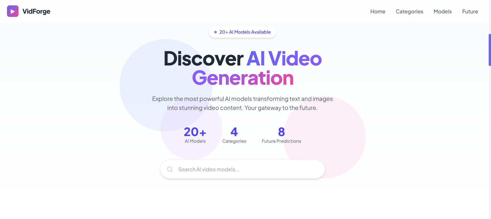

# VidForge

VidForge is a modern web application for discovering and exploring AI video generation tools. Built with Vite, React, and TypeScript, it provides a polished interface for browsing tools by category, reviewing model details, and exploring future trends in AI video creation.

## Overview

The application is designed to make AI video tooling easier to navigate through searchable content, category-based filtering, and structured UI sections. It also includes interactive modal experiences and a reusable component-driven design system for maintainability and scale.

## Features

- Search AI video generation tools quickly and efficiently
- Filter tools by category for easier discovery
- Explore model details through interactive modals
- Browse category information in dedicated modal views
- View curated sections for Hero, Categories, Models, and Future Predictions
- Use a reusable Tailwind-based UI system across the application
- Experience an animated Aurora background integrated into the interface

## Screenshot



## Tech Stack

- **Vite** for fast development and build tooling
- **React 18** for component-based UI development
- **TypeScript** for static typing and maintainable code
- **Tailwind CSS** for utility-first styling
- **Zustand** for lightweight state management
- **Lucide React** for iconography

## Project Structure

```txt
src/
  App.tsx
  main.tsx
  index.css
  components/
    demo.tsx
    ui/
      aurora-background.tsx
      glowing-effect.tsx
  data/
    mockData.ts
  lib/
    utils.ts
  store/
    useAppStore.ts
  types/
    models.ts
```

## Getting Started

### Prerequisites

Make sure you have the following installed:

- Node.js
- npm

### Installation

Install project dependencies:

```bash
npm install
```

### Development

Start the local development server:

```bash
npm run dev
```


## Styling and UI

VidForge uses Tailwind CSS as the foundation of its design system, with reusable utilities and UI components to keep styling consistent across the application. Global styles, theme tokens, and CSS variables are defined in `src/index.css`.

Key UI-related files:

- `src/components/ui/aurora-background.tsx`
- `src/components/ui/glowing-effect.tsx`
- `src/components/demo.tsx`

Aurora animation support is configured through Tailwind using custom keyframes and the `animate-aurora` utility.

## Data and State Management

Application data is currently sourced from `src/data/mockData.ts`, making it straightforward to iterate quickly during development. Global application state is managed with Zustand in `src/store/useAppStore.ts`.

## Utilities

Shared helper functions are located in `src/lib/utils.ts`. This includes utilities such as `cn()` for composing conditional class names cleanly across components.

## Documentation

Additional product and specification notes are available in:

- `SPEC.md`

## Development Notes

The project follows a modular React structure intended to support reuse, scalability, and easier maintenance. The current setup is well-suited for extending the platform with live APIs, richer filtering, authentication, or personalized recommendation features.
